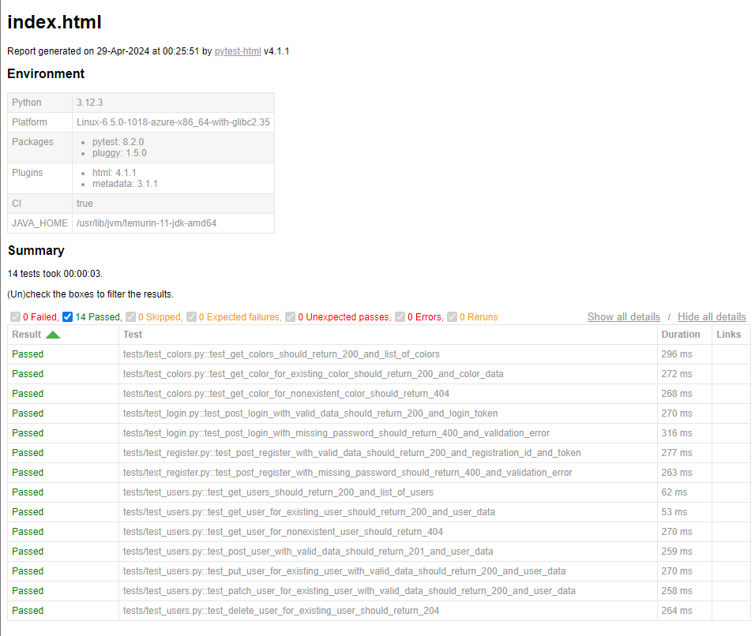
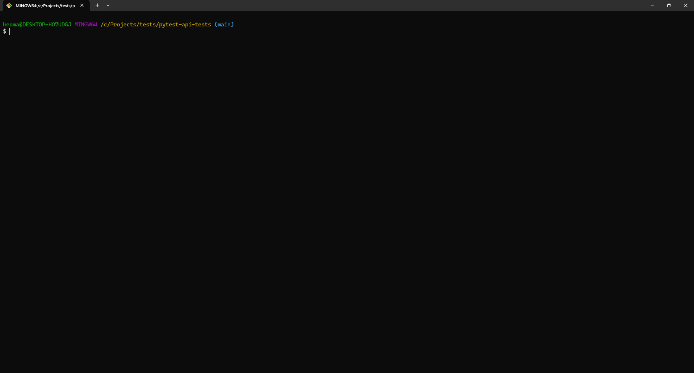

# Pytest API Tests

A sample API test automation project in [Pytest](https://docs.pytest.org/en/8.2.x/), using [Requests](https://requests.readthedocs.io/en/latest/), [assertpy](https://assertpy.github.io/), and [pytest-html](https://pytest-html.readthedocs.io/en/latest/).

## ReqRes

The API chosen for testing was ReqRes. It simulates how a real application behaves, is highly available and accessible from anywhere. For more information, visit their website [here](https://reqres.in/).

## How it works

The project uses Pytest as the test framework, assertpy as the assertion library, Requests as the HTTP client to perform API requests, and pytest-html to generate HTML reports.  
A workflow is set up to install Python, install the required packages, run the tests, and publish the HTML report to GitHub Pages. The report can be viewed [here](https://kafziel4.github.io/pytest-api-tests/).

## How to run it

- Install [Python](https://www.python.org/)
- Install the project packages: `pip install -r requirements.txt`
- Run the tests: `python -m pytest`

